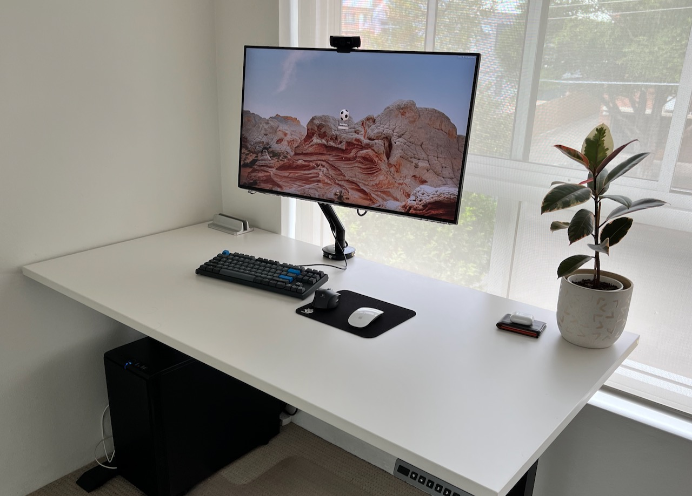
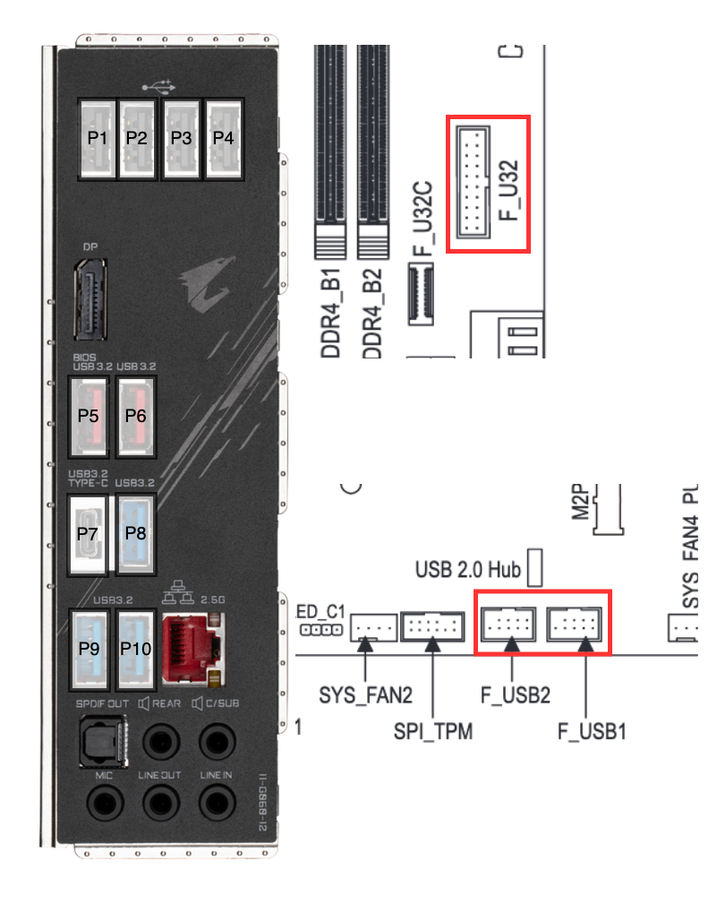
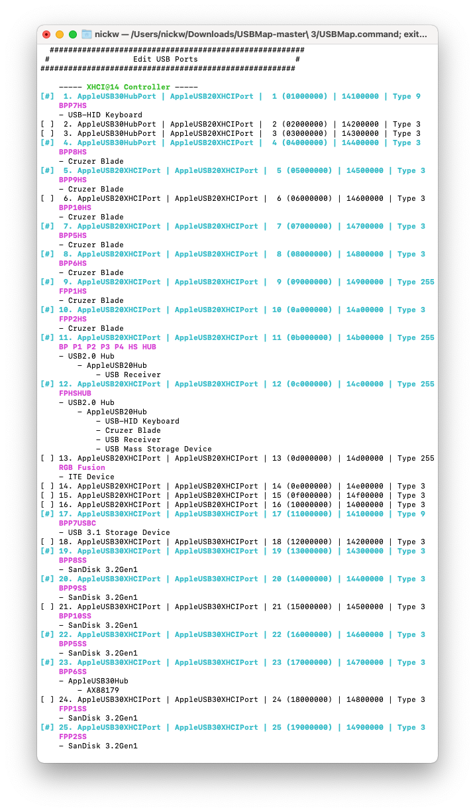

# Gigabyte Z590 Aorus Elite Monterey Hackintosh 🍎

## 🖥 Hardware Details
| Component | Details                                                                    |
|-----------|----------------------------------------------------------------------------|
| CPU       | Intel Core i7 11700K (Rocket Lake)                                         |
| Mobo      | Gigabyte Z590 Aorus Elite                                                  |
| GFX       | Radeon RX 580 8 GB (`GV-RX580GAMING-8GD`)                                  |
|           | Intel UHD Graphics 750 (Unsupported)                                       |
| Audio     | Realtek ALC1220-VB                                                         |
| Network   | Realtek 2.5GbE (`RTL8125`)                                                 |
|           | BCM943602CS (Identified as BCM94360CD) AirPort Extreme  (0x14E4, 0x133)    |
| Bluetooth | BCM943602CS                                                                |
| Storage   | NVMe Samsung 980 PRO 1TB (MacOS Boot, PCIe 4.0)                            |
|           | NVMe Samsung 970 EVO Plus 1TB (Windows Boot)                               |
|           | SATA SanDisk SDSSDHII480G                                                  |




## ⚠️⚠️ Warning ⚠️⚠️

This is the EFI configuration for my **very specific** combination of hardware. It comes with **absolutely no guarantees** whatsoever.

It is extremely unlikely that this configuration will even work for you, even if your hardware combination is very similar. Please use it as a learning/reference resource only.

### EFI, in git?

For my sanity, I have revisioned my `/Volumes/EFI/EFI` directory under git. This allows me to easily diff any changes I have made and easily roll back at any point in time.

However, typically the `EFI` partition is a tiny, around 200MB in size. This does not work well when there is a `.git` directory living inside, as every revision of binary files will be stored in here, easily filling up the space.

As a workaround, [it is possible](https://stackoverflow.com/a/40561395/913363) to place the `.git` directory across different mount-points by instead creating a file, `.git` and pointing it to the real `.git` location with the following directive:

```
gitdir: /Users/nickw/repos/opencore-efi-z590/.git
```

### Secret Management

With this repository being publicly shared on GitHub, there are going to be things I do not wish to share, such as `SystemUUID`, `SystemSerialNumber`, `ROM`, and `MLB`. I do not check in my `config.plist`, instead `config.redacted.plist` with these private fields redacted.

## ❓ Guides

* [Dortania Comet Lake Install Guide](https://dortania.github.io/OpenCore-Install-Guide/config.plist/comet-lake.html)
* [Dortania Z590 compatibility write up](https://dortania.github.io/hackintosh/updates/2021/04/24/rocket-lake.html)


## ✅ Past Success for similar board

* [GA Z590 Gaming X / Core i9 11900k](https://www.insanelymac.com/forum/topic/348501-ga-z590-gaming-x-core-i9-11900k-with-thunderbolt-full-dsdt-patches-guide-and-discussion/)
* [Z590 Aorus Elite AX Core i7-10700K](https://www.tonymacx86.com/threads/success-big-sur-11-2-3-gigabyte-z590-aorus-elite-ax-rev-1-0-intel-core-i7-10700k-intel-uhd-630-msi-rx-580-8gb.311880/)
* [GA Z590 UC AD / Core i9 11900k](https://www.olarila.com/topic/13650-olarila-hackbeast-ga-z590-uc-ad-core-i9-11900k-with-thunderbolt-full-dsdt-patches-guide-and-discussion/)

## 💤 Sleep/Wake

* Still testing this! Appear to be having wake failures during long term sleep. Might be caused by Intel Power Gadget.

## 🖥 Hardware

### ⚙️ BIOS Settings

#### Diffable Settings:

* Defaults as base

<!-- TODO BIOS settings -->

### 🔊 Audio

Works OOB with [AppleALC](https://github.com/acidanthera/AppleALC/) using `layout-id=1`

### ⌨️ USB

#### Port Mapping



**Back Panel**

| Physical Port Number | USB2 Personalality APCI Port  | USB3 Personality APCI Port   |
|----------------------|-------------------------------|------------------------------|
| P1                   | Via hub connected to Port #11 | N/A                          |
| P2                   | Via hub connected to Port #11 | N/A                          |
| P3                   | Via hub connected to Port #11 | N/A                          |
| P4                   | Via hub connected to Port #11 | N/A                          |
| P5                   | Port #7                       | Port #22                     |
| P6                   | Port #8                       | Port #23                     |
| P7 (USB C)           | Port #1                       | Port #17                     |
| P8                   | Port #4                       | Port #19                     |
| P9                   | Port #5                       | Port #20                     |
| ~~P10~~              | ~~Port #6~~                   | ~~Port #21~~                 |

**Internal Headers**

| Physical Port Number        | USB2 Personalality APCI Port  | USB3 Personality APCI Port |
|-----------------------------|-------------------------------|----------------------------|
| F_U32 (P1)                  | Port #9                       | ~~Port #24~~               |
| F_U32 (P2)                  | Port #10                      | Port #25                   |
| F_USB1 (P1)                 | Via hub connected to Port #12 | N/A                        |
| F_USB1 (P2)                 | Via hub connected to Port #12 | N/A                        |
| F_USB2 (P1)                 | Via hub connected to Port #12 | N/A                        |
| F_USB2 (P2)                 | Via hub connected to Port #12 | N/A                        |
| ~~RGB Fusion (ITE Device)~~ | ~~Port #13~~                  | N/A                        |

_note_: This mapping is missing the front panel USB C connector as I do not have front panel USB C on my case. Additional mapping would be required to determine the ACPI location of the port. Strikethrough lines indicate physical ports which are not enabled in the map to ensure we stay within the 15 port limit

**PCI/ACPI Map**

The above listed ports/locations are found by temporarily using [USBInjectAll](https://github.com/Sniki/OS-X-USB-Inject-All/) to inject all ports to find their location IDs. These IDs can then be worked into an injector kext using [USBMap](usb-map.gitbook.io/).

The Z590 Aorus Elite board doesn't appear to need a XHC1 rename patch, as the XCHI controller sits at `XHCI` ACPI name. However, as above, we see that this board has over 15 ACPI connected USB ports, above the Mac OS limit of 15 ports. Because of this, the `XhciPortLimit` quirk must be enabled to create an initial map of all functioning ports. In my mapping, I noticed when `XhciPortLimit` is enabled alongside `USBInjectAll`, the USB2 personality of many back panel ports did not work. Disabling `XhciPortLimit` and keeping `USBInjectAll` allowed for these to also be mapped (I believe I also needed to use `-uia_exclude_ss` boot flag).



After creating a `USBMap.kext` with the ports we want to enable (less than 16 ports), `XhciPortLimit` can be removed and `USBInjectAll.kext` can be disabled.

To keep within the port limit I excluded the following physical ports:

* **F_U32 (P1)**:  USB 3 personality (Port #24). The USB 2 personality of this port is used by the `BCM943602CS` USB connector, and therefore the USB 3 personality will never be used.
* **RGB Fusion (ITE Device)**: USB 2 personality (Port #13) - My case has no windows so no need to control RGB headers.
* **Back Panel P10**: Both USB 2 and USB 3 personalities (Port #6, Port #21). Necessary final removal to reach 15 port limit.

If I ever add front panel USBC, I will likely need to remove another back panel USB port to make way for an additional port to be mapped.

**BCM943602CS USB Connector**

In order to avoid phantom wake events from the `BCM943602CS` USB Bluetooth adapter, it must be connected to a mapped port marked as type `255 (Internal Connector)`. Since all internal USB2.0 connectors are connected via a hub, we cannot use these ports to internally connect the plug.

However, because the USB 2 personality of the front panel USB 3 connector can be mapped as ACPI ports, we can use these ports for the `BCM943602CS` internal USB connector.

I had previously experimented with a USB 3 20 pin to female A type connector cable, connected to a male A type connector cable for the second front panel USB 3 port. Unfortunately this caused issue with USB detection of the second FP port. Instead a splice was made directly in the cable from the case. It may be worth "unsplicing" if a new mobo has better internal USB support (e.g. front panel USB2.0 connectors are not connected to the chipset via a hub)

**RHUB Reset**

RHUB reset DSDT is not needed for this motherboard.

**Fix Keyboard Wake**

Source: [Dortania - Keyboard Wake Issues](https://dortania.github.io/OpenCore-Post-Install/usb/misc/keyboard.html#method-1-add-wake-type-property-recommended)

Sometimes macOS requires a second keyboard press or some other wake event to power up the monitor as well, with some requiring a keypress+power button to wake.


```xml
<key>PciRoot(0x0)/Pci(0x14,0x0)</key>
<dict>
    <key>acpi-wake-type</key>
    <data>AQAAAA==</data>
</dict>
```

### 🕸 Ethernet

The 2.5GbE is a RTL8125, and is supported via [LucyRTL8125Ethernet](https://github.com/Mieze/LucyRTL8125Ethernet)


### 🖥 Intel 11700K / Intel UHD Graphics 750

Rocket Lake has not been shipped in any production Mac yet, as such we need to:

**Emulate the CPUID**

```xml
<key>Cpuid1Data</key>
<data>VQYKAAAAAAAAAAAAAAAAAA==</data>
<key>Cpuid1Mask</key>
<data>/////wAAAAAAAAAAAAAAAA==</data>
```

**Disable Intel UHD Graphics 750 graphics**

Disable Intel UHD Graphics 750 graphics if enabled in BIOS. This can be avoided if running a 11th gen "F" CPU (no GPU) or if IGFX is disabled in BIOS. (I want IGFX acceleration available for Windows)

The following `DeviceProperties` need to be be added to disable iGPU:

```xml
<key>PciRoot(0x0)/Pci(0x02,0x0)</key>
<dict>
    <key>disable-gpu</key>
    <data>AQAAAA==</data>
</dict>
```

### 🔌 CPU Power Management

Appears to be working out of the box. Cross check with Intel Power Gadget if unsure.


### 📶 Bluetooth / WiFi w/ Broadcom Card

BCM943602CS: 802.11ac 3x3, (1.3Gbps / 5GHz) + Bluetooth 4.1. The module will be applied in MacBook Pro computers (2015)

* BCM43602 14e4:43ba supported in 3.17+ (brcmfmac)
* BCM43602 14e4:43bb 2.4GHz device, supported in 3.19+
* BCM43602 14e4:43bc 5GHz device, supported in 3.19+

Bluetooth USB connection must be connected to a ACPI mapped port, marked as internal (type 255), otherwise this will cause random wake as soon as machine goes to sleep. See above in the USB section for more details.
